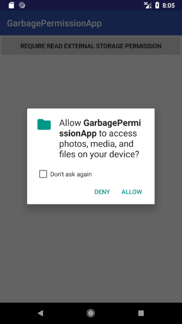

# Garbage Permission
### Introduction

​就像项目的名字一样，这一个Garbage 的 `Permission` 请求类库. ​:joy:​ .  如果有任何的Bug和需求欢迎大家提交PR，在此拜谢。

### 展示展示效果图

 


### How to use

```kotlin
//Way 1
GarbagePermission
        .with(this)
        .permissions(arrayOf(
                Manifest.permission.READ_EXTERNAL_STORAGE,
                Manifest.permission.WRITE_EXTERNAL_STORAGE,
                Manifest.permission.CALL_PHONE))
        .callback(object : OnPermissionRequestListener {
          	//当权限被同意的时候，此方法被调用
            override fun onGranted(permission: String) {
                Log.e("TAG", "Granted")
            }
          	//当权限被完全拒绝的时候(勾选了不再提醒复选框)，此方法被调用
            override fun onDenied(permission: String) {
                Log.e("TAG", "Denied")
            }
          	//当权限被拒绝的时候但并非完全拒绝的时候，此方法被调用 
            override fun onRationale(permission: String) {
                Log.e("TAG", "Rationale")
            }
        })
        .request()
//Way 2
GarbagePermission
        .with(this)
        .permissions(arrayOf(Manifest.permission.READ_EXTERNAL_STORAGE))
        .callback(object : SimpleOnPermissionRequestListener() {
            override fun onGranted(permission: String) {
                Log.e("TAG", "Granted")
            }
        })
        .request()
```


### Add it into your project

To get a Git project into your build:

**Step 1.** Add the JitPack repository to your build file

Add it in your root build.gradle at the end of repositories:

```
	allprojects {
		repositories {
			...
			maven { url 'https://www.jitpack.io' }
		}
	}
```

**Step 2.** Add the dependency

```
	dependencies {
	        implementation 'com.github.littledavid-tech:GarbagePermission:V1.0.1'
	}
```

### Thanks

关于这个开源的 Permission 框架的开发中，[这个博客](https://www.jianshu.com/p/2324a2bdb3d4) 给我了太多的灵感，甚至完全可以说，这个框架的是从那里学习过来的。